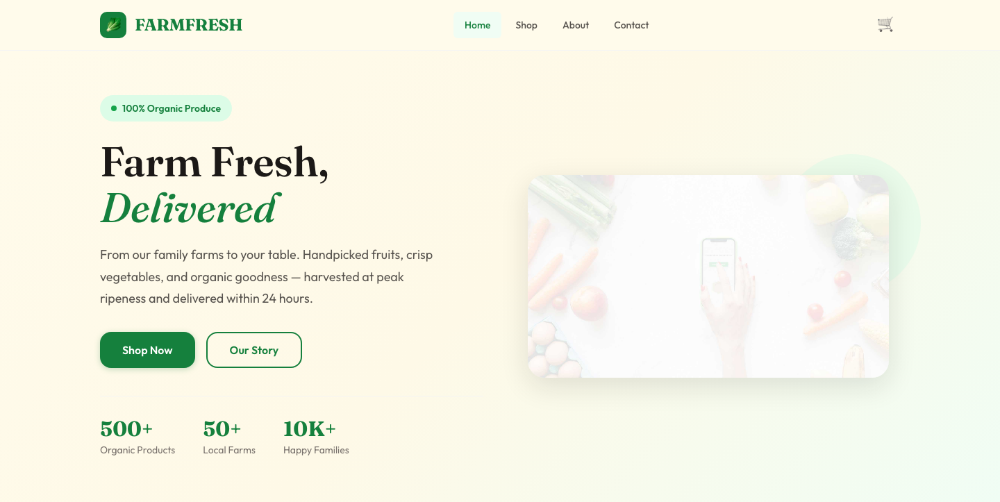

# Fruitables HTML Template — FARMFRESH

**Organic produce marketplace. Farm to Table, Fresh Daily.**

A warm, premium HTML template for organic food e-commerce — featuring Fraunces serif display type, clean Outfit body text, forest green and brown accents on a cream ground, product cards with organic badges, a working cart demo, and fully responsive layouts across 4 pages.

---

## 📸 Screenshot



## Live Pages

| Page | File | Description |
|------|------|-------------|
| Home | [index.html](index.html) | Hero, categories, featured products, testimonials, newsletter |
| Shop | [shop.html](shop.html) | Full product grid, category filter tabs, sidebar filters |
| About | [about.html](about.html) | Company story, mission, values grid, team section |
| Contact | [contact.html](contact.html) | Contact cards, form, FAQ, location & hours |

---

## Features

- **Fraunces + Outfit** from Google Fonts — warm serif display, clean sans body
- **Forest green / brown / cream** color system with 50+ CSS custom properties
- **Product cards** with image, price badge, organic/new/sale badges, add-to-cart buttons
- **Cart demo** with header counter, add animation, and "Added!" tooltip
- **Category filter tabs** on shop page with animated transitions
- **Sticky sidebar** with category, price, and certification filters
- **IntersectionObserver reveals** with stagger animations
- **Responsive** — 980px two-column, 720px single-column + hamburger menu
- **Reduced motion** respected via `prefers-reduced-motion`
- **Newsletter forms** with validation, success/error states (no alerts)
- **Footer** with brand, links, newsletter, payment icons, dynamic year
- **Zero frameworks** — pure HTML, CSS, vanilla JS

---

## Quick Start

1. Open `index.html` in any browser — no build step required.
2. All 31 images are pre-loaded in `assets/img/`.
3. Customize colors by editing CSS custom properties in `:root`.

```bash
# Or serve locally
cd fruitables-html-template
python3 -m http.server 8080
# Open http://localhost:8080
```

---

## File Structure

```
fruitables-html-template/
├── index.html              # Home page
├── shop.html               # Shop with filters
├── about.html              # About / story
├── contact.html            # Contact form & FAQ
├── README.md               # This file
└── assets/
    ├── css/
    │   └── style.css       # Full design system (750+ lines)
    ├── js/
    │   └── main.js         # Burger, reveals, cart, forms
    └── img/
        ├── hero-img.jpg          # Hero background
        ├── fruite-item-1..6.jpg  # Fruit product images
        ├── vegetable-item-1..6   # Vegetable product images
        ├── best-product-1..6.jpg # Featured products
        ├── testimonial-1.jpg     # Testimonial avatar
        ├── avatar.jpg            # Default avatar
        ├── banner-fruits.jpg     # About banner
        ├── payment.png           # Payment methods
        └── ...                   # (31 images total)
```

---

## Tech Stack

| Layer | Technology |
|-------|-----------|
| Markup | Semantic HTML5 |
| Styling | CSS3 Custom Properties, Grid, Flexbox |
| Scripts | Vanilla JavaScript (ES6, IIFE) |
| Fonts | Google Fonts (Fraunces, Outfit) |
| Animations | IntersectionObserver + CSS transitions |
| Frameworks | None — zero dependencies |

---

## Customization

All design tokens live in `:root` inside `assets/css/style.css`:

```css
:root {
  --green-700: #15803D;    /* Primary green */
  --brown-700: #92400E;    /* Secondary brown */
  --cream: #fffbeb;         /* Background */
  --dark-900: #1C1917;      /* Text */
  --font-display: 'Fraunces', serif;
  --font-body: 'Outfit', sans-serif;
}
```

Swap these values to rebrand the entire template in seconds.

---

## SEO Keywords

organic produce, farm fresh delivery, organic fruits, organic vegetables, farm to table, local organic food, fresh produce online, organic marketplace, healthy food delivery, farm fresh produce

---

## License

Free for personal and commercial use. Attribution appreciated but not required.

---

Let's Build Something Together 🚀
https://tally.so/r/q4q1L9
